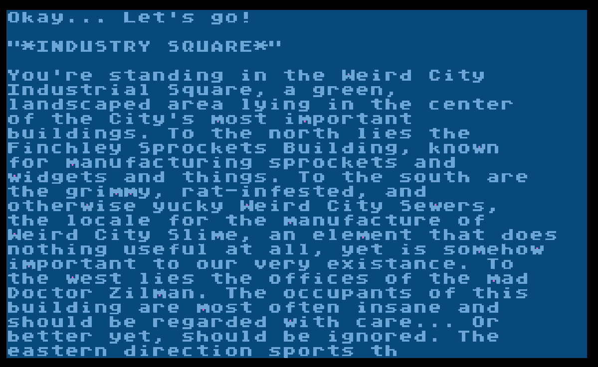

# Scavange
A text adventure game for the Atari 8-bit computer, written in Atari BASIC

I wrote this game circa 1988. It was on floppy disk of Atari computer games that I wrote in middle-to-high school.

This is a text adventure game called SCAVANGE, with a spelling error right there in the title. It's a scavenger hunt that I wrote for use by callers to Weird City BBS (I still remember the number: 213-273-5234.) I don't know if anyone ever played it.

The game doesn't have a traditional parser because I was lazy and/or didn't know how to implement one. It only allows a small number of one-letter commands (such as P for push.)

Scavange-original.ATR is the game as I left it in 1988, playable in your Atari emulator...except for the two showstopping bugs that I found and fixed in 2020. As much as I wanted to fix other things (like my spelling) I didn't. 
